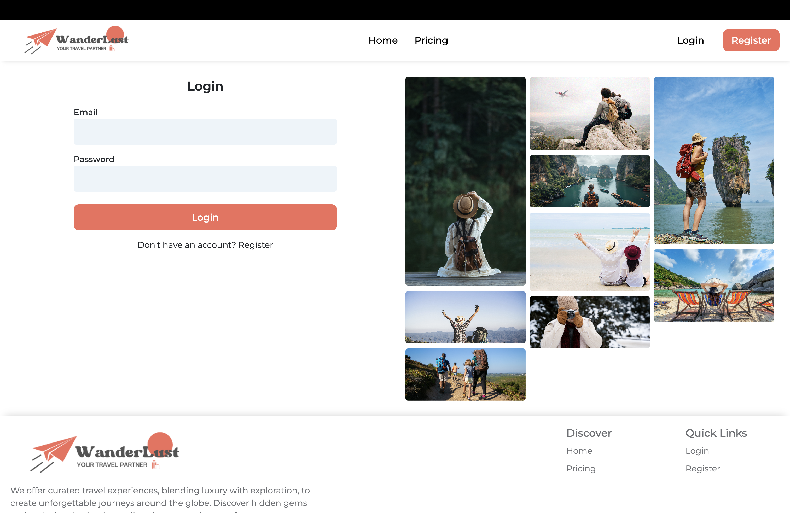

<h1 style="border-bottom: none; margin-bottom: 0;">
  WanderLust - Full Stack Travel Booking Web Application
</h1>

Hosted at: https://wander-lust-nu-three.vercel.app/

### Features
Implemented two distinct modules: a user-facing module for consuming the services, and an admin management module for overseeing data ensuring clear separation of concerns and streamlined workflows.

User Module:
- Select and book your trip from a range of Packages accross different destinations
- Each package involves different destinations and has limited vacancies
- Each destination is coupled with a set of additional activities which can be opted for
- The final price is calculated based on a membership module (premium user: 50%, gold user 10% , normal user 0%)

Admin Module
- The Admin can view and manage (add/edit/delete) all the tours, destination, activities, bookings, users and orders

P.S. Signing/Logging in as an admin requires a secret admin key

### Highlights
- Readable and Maintainable code
- Followed best coding practices to maintain high code quality and adhere to industry standards.
- Responsive design principles are applied to every page throughout the website

## Version history

### v2 (current)
Whats new?
- Migrated the backend code from express.js to Nest.js
- secure token based authentcation
- Introduction of MobX for storage and AntD for toast messages all over the application
- use of memoization techniques in the frontend
- implemented loader states (both full page and component level)
- Modular backend code strucutre 
- Global exception handling
- Swagger Documentation of the endpoints
- standard reposiory folder and component structure
- Minor UI modifications

### v1 
- Implemented a basic backend using Express.js by connecting to MongoDB database
- In application storage and management of images (using multer)
- Built the frontend using React, Tailwind, CSS, Redux and Material-UI

## A sneak peek into what we have here!

### Home Page

### Login Page

### Profile Page

### Pricing Page

### Admin Manage Tour Page (for more pictures visit readmeassets in the main directory)

## Technology Stack

**Tools & Frameworks**: 
 
  

**Tools & Frameworks**: 
 
      

**Project Management Tools**: 
 
 

## Developer

- Md Riyaz Ahmed

